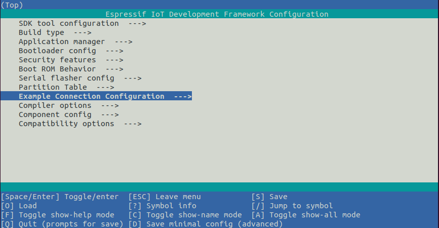

# Epaper weather station
Collection of examples to read sensors (I2C and others) and publish real-time information with minimum consumption using fast ESP32S3 and epaper controllers such as IT8951

The goal of this repository is make a deep dive into ESP32 IDF components (That are also compatible with latest Arduino-esp32) and make examples that read sensors and provide real-time data such as: 

- BME280 (Pressure, Humidity, Temperature) Note: using only first uppercase in the cases below
- BMP280 & BMP180 (P, T)
- DS3231 modules (RTC Real-time clock, additional T readings)
- Light sensor to update the epaper only when there is ambient light (And save power at night)
- Any others that you sent us or we have around our studio

The goal will be to connect to internet to sync time and save it in the DS3231 memory. Only if you need addional internet data such as loading a JSON feed or a JPG background image every hour, we will have examples, but as long we use WiFi intensively we drift away from the low-consumption specs. The use of WiFi implies a consumption of 150 to 250 mA/hr (peaks) while ESP32 transmits and receives information. 

## Initial RTC configuration

The DS3231 module sets the real-time clock initial value using NTP time Server.
In order to avoid building the WiFi code we use the example connection confituration example. Please set your WiFi credentials using menuconfig:

## PCB breadboard and open source SPI HAT

As a display we would like to use a modern and powerful IT8951 9.7" using LovyanGFX as a component, or similar size epaper controller, but also this could be adapted to use our [component CalEPD](https://github.com/martinberlin/CalEPD).
It will be possible to use any 8-bit parallel epaper with an EPDiy component and compatible board.
At the same time since Lovyan GFX supports a pletora of displays including hi-speed 8 and 16 bit parallel TFT's this work is possible to be ported to any of them. 

## Additional IT8951 PCB controller

If you are interested in making a low-consumption, hi-resolution epaper project then IT8951 controller is an affordable choice and it's sold both by:

- [Waveshare 10.3" epaper kit, 16-bit parallel](https://www.waveshare.com/product/displays/e-paper/epaper-1/10.3inch-e-paper-hat.htm), being the most expensive option. Other cheaper options are also available using the same Eink IT8951 controller
- [Goodisplay DEXA-C097 9.7" Cinread epaper controller, 8-bit parallel](https://www.good-display.com/product/425.html) which has a nice resolution at 1200*825 and it's affordable at 56 dollars per unit.

This is the demo-board we make for this project, that you can also make yourself, withouth the need to buy our PCB adapter.

And this is the Cinwrite SPI master controller that we design in order to make a product that fits standards and is compact enough to use in a nice 3D-printed case

This will be soon available in Tindie but [Cinwrite PCB is also open source](https://github.com/martinberlin/H-cinread-it8951) so you can fabricate it yourself if you want and use it also for a commercial project (As long as credits are given as the License states)

Here we will publish the recollection of C components and demos to make this happen. Make sure to keep updated!

Hit the ⭐ button to be aware of this repository updates.