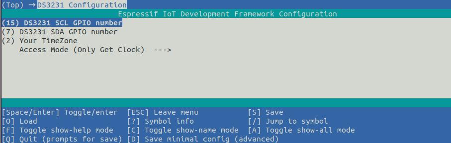
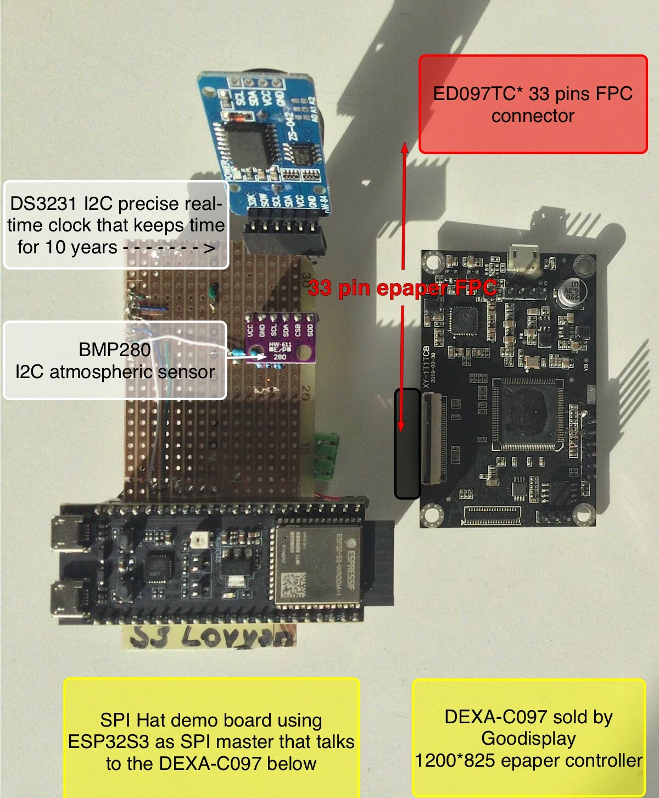

# Epaper weather station

This code base will host a collection of examples to read sensors (I2C and others) and publish real-time information with minimum consumption using fast ESP32S3 and epaper controllers such as IT8951 in bi-stable epaper displays.
The development framework used is Espressif-IDF and the component folder contains submodules that might point to another repositories, like the Bosch official libraries.
This repository aims to be a proof-of-concept Firmware, that you should customize to make your own tailor-made solution, but is not by any means a finished product. 
Go through the examples and have fun customizing it until finding the right layout and functionality that works for your project. If you like the code and want to collaborate with the project, pull-requests are welcome, and buying our [Cinwrite ESP32S3 SPI master PCB](https://www.tindie.com/stores/fasani) with RTC is more than welcome.

After cloning this repository run additionally:

    git submodule update --init --recursive

So you pull also the component submodules. Also make sure to set the right target for your MCU before running menuconfig:

    idf.py set-target esp32s3

    or if you use an ESP32:

    idf.py set-target esp32

The goal of this repository is make a deep dive into ESP32 IDF components, that are also compatible with latest Arduino-esp32, and make examples that read sensors and provide real-time data such as: 

- BME280 (Pressure, Humidity, Temperature) Note: using only first uppercase in the cases below
- BMP280 (P, T)
- DS3231 modules (RTC Real-time clock, additional T readings)
- SCD40/41 module (CO2 level, T, humidity)
- Use the RTC to wake up station at a defined hour (And save power at night)
- Any others that you sent us or we have around our studio

The goal will be to connect to internet to sync time and save it in the DS3231 memory. Only if you need addional internet data such as loading a JSON feed or a JPG background image every hour, we will have examples, but as long we use WiFi intensively we drift away from the low-consumption specs. The use of WiFi implies a consumption of 150 to 250 mA/hr (peaks) while ESP32 transmits and receives information.
Also the main goal of using this repository is to support affordable epaper displays that you can buy in Aliexpress or eBay, those that can be also powered by [EPDiy project](https://github.com/vroland/epdiy) which uses a single PCB to drive them. But also as a second option, the powerful IT8951, that is sold at the moment by Good-Display (9.7" 1200*825) and Waveshare (higher resolution, but more expensive modules).

This is all open source and collaborations are needed. We would like to support as many displays and sensors as possible.

## Required hardware

- **An epaper display**
 9.7" epapers are possible to find in Aliexpress around 30 dollars per unit (ED097OC4, ED097TC2, ED097TC1) it really does not matter much the model for a test display since all parallel are driven by the same controller as long as the FPC pin count match.
- [**Epaper controller board**](#it8951-pcb-controller), for now we use IT8951 but [EPDiy](https://github.com/vroland/epdiy) can be also used, we will drop examples soon.
- **DS3231** real time module, found in eBay or Aliexpress for around 3 dollars (But also included in our PCB)
- **ESP32S3** or ESP32 dev board to talk SPI to the epaper controller. Also some breadboard PCB so you can solder a few wires, or to use our [Cinwrite HAT PCB](https://www.tindie.com/stores/fasani), which has also a DS3231 RTC on board and many other goodies including a 5V booster in case you need to power an IT8951 board.

## Initial RTC configuration

The DS3231 module sets the real-time clock initial value using NTP time Server.
In order to avoid building the WiFi code we use the example connection configuration example. Please set your WiFi credentials using menuconfig:

Additionally make sure to also configure the DS3231 I2C IOs that are connected to your ESP32:

For the first run make sure to also set your timezone and use **Access mode:** Set Clock & Get Clock
In this initial mode, it will connect to the WiFi you've set up before, and grab the date from internet in order to store it on the DS3231 memory. After that you can flash it again with Get Clock mode and it should keep the time. 
And do not forget that each of the I2C lines need a pull-up resistance to 3.3V (4.7K Ω or similar value).

We will add some Non Volatile Storage (NVS) settings in the future, so the initial clock setting will be done automatically. 

## PCB self-made breadboard and open source SPI HAT

As a display we would like to use a modern and powerful IT8951 9.7" using LovyanGFX as a component, or similar size epaper controller, but also this could be adapted to use our [component CalEPD](https://github.com/martinberlin/CalEPD).
It will be possible to use any 8-bit parallel epaper with an EPDiy component and compatible board.
At the same time since Lovyan GFX supports a pletora of displays including hi-speed 8 and 16 bit parallel TFT's this work is possible to be ported to any of them. 

## IT8951 PCB controller

If you are interested in making a low-consumption, hi-resolution epaper project then IT8951 controller is an affordable choice and it's sold both by:

- [Waveshare 10.3" epaper kit, 16-bit parallel](https://www.waveshare.com/product/displays/e-paper/epaper-1/10.3inch-e-paper-hat.htm), being the most expensive option. Other cheaper options are also available using the same Eink IT8951 controller
- [Goodisplay DEXA-C097 9.7" Cinread epaper controller, 8-bit parallel](https://www.good-display.com/product/425.html) which has a nice resolution at 1200*825 and it's affordable at 56 dollars per unit. We are designing an ESP32S3 HAT for this controller since it's the most affordable.

This is the demo-board we make for this project, that you can also make yourself, without need to buy our PCB adapter.

And this is the Cinwrite SPI master controller that we design in order to make a product that fits standards and is compact enough to use in a nice 3D-printed case

This will be soon available in Tindie but [Cinwrite PCB is also open source](https://github.com/martinberlin/H-cinread-it8951) so you can fabricate it yourself if you want and use it also for a commercial project (As long as credits are given as the License states)

Here we will publish the recollection of C components and demos to make this happen. Make sure to keep updated!

Hit the ⭐ button to be aware of this repository updates.